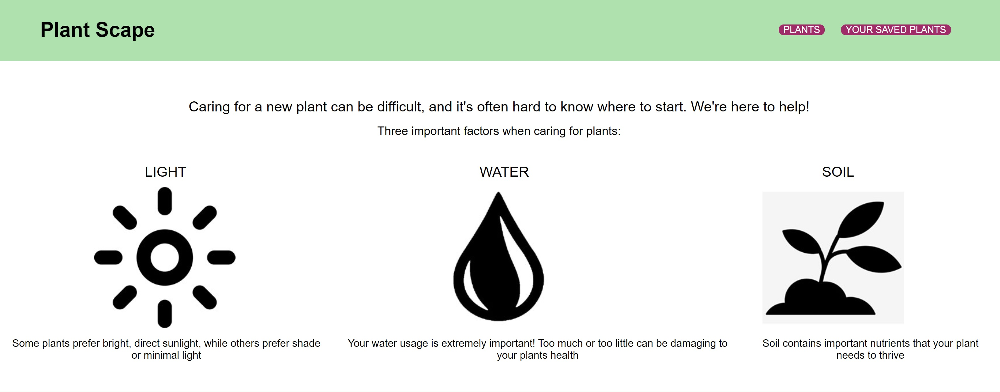
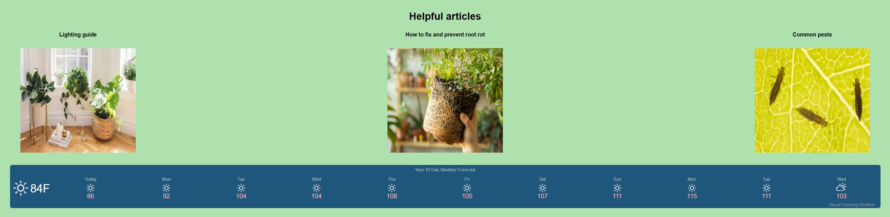
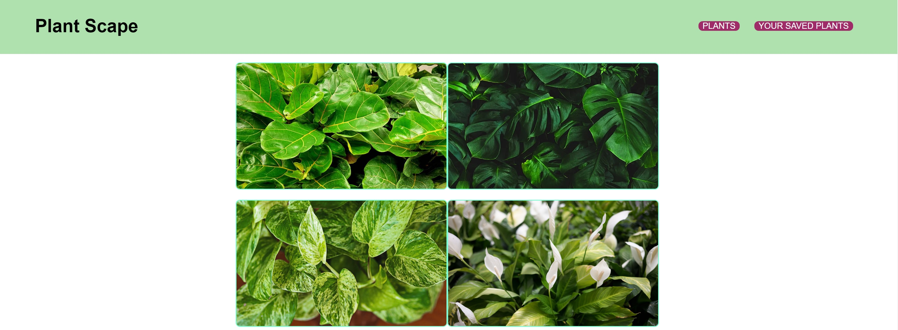
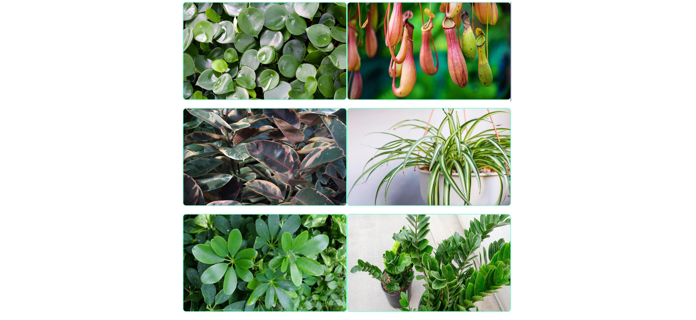
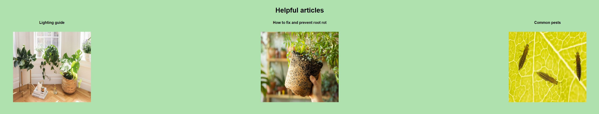

# plant-project

## Description 
This functional website is perfect for those who are looking for further care information on the plants that they already own, or one's their looking at purchasing.

## Table of Contents
[Installation](#installation)
[Usage](#usage)
[Screenshot](#screenshots)
[Built With](#built-with)
[Website](#website)
[License](#license)

## Usage 
In order to use Plant Scape, please refer to the following images:

## Screenshots

 

Step 1: https://danpoggetti.github.io/plant-scape/

Step 2: Review home page and gather further information on what your plants may need 

Step 3: Choose to either click on one of the three helpful links or "Plants" 

Step 4: If "Plants" was clicked, the current plants in the inventory will appear

Step 5: Click on which plant you'd like to view. That specific plant page will then appear, giving you the full care that it needs, as well as some extra information on the plant

Step 6: Click "Add to greenhouse" to add it to your saved plants. You can then either go back to the "Plant" page or go to "Your saved plants" 

Step 7: "Your saved plants" will display the plants you have saved, making it easier to access for the future 

## Built with 
*HTMl
*CSS
*Javascript 

## Website 
https://danpoggetti.github.io/plant-scape/

## Contribution 
Alexus Christensen 
Github username: Alexusdc
Email: Alexusdc6@gmail.com

Dan Poggetti 
Github username: danpoggetti
Email: danpoggetti@gmail.com

Diego Pena 
Github username: Diegop2022
Email: diegopena2022@gmail.com

Vanessa Ortega 
Github username: 
Email: nessortega117@gmail.com
